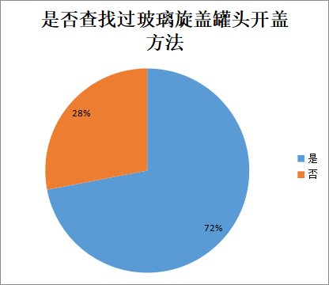
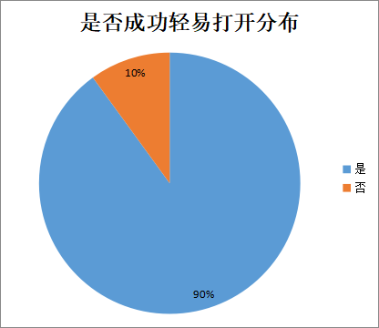

 <h1>通过Python模型对玻璃型扭盖罐头的便捷打开方式研究</h1>
 
作者：夏子涵，闫亮，李浩然

 
指导老师：周胜军，黄芳

 
本论文根据CC BY-NA-SC 4.0协议开源。

 
本论文的版权归作者所有，该论文授权给北京师范大学数学建模大赛。

## 摘要
    在日常生活中，我们打开罐头¹时，总会碰到需要用很大力气大开罐头的情况，并且有事还会出现罐头瓶破碎、液体喷洒等现象。所以本论文我们以此为论题，关于实验探究给出实用的方法，同时，通过Python模型以及实验探究对罐头瓶进行创新改造，为日常生活中力气较小的人提供便利。

> ¹本文中无特殊说明，罐头一律指玻璃型扭盖罐头

## 关键词
    实用，Python，日常，罐头，实验

# 第一章 绪论
## 1.1 研究背景及其意义
1.1.1 研究背景

    食品罐头行业发展现状、罐头密封特性与开启困难的普遍痛点、现有开启方式的不足与安全隐患。

1.1.2  问题分析

    本次实验我们将采取多种实验方法，以及日常生活中开启罐头的方法，进行科学比较，并使用Python模型赋能实验数据，让实验数据更明显、有严谨性、有说服力。

1.1.3 人口问询调查

    在本次调查²中我们一共问询了100人，以突出实验的严谨性。

    
    
是否查找过打开罐头方式

    
    
开盖成功率

> ²在本次调查中，罐头均为同一品牌，同一SKU（最小销售单元）。

## 1.2 实验方法

1.1.1 打开罐头的方法

1. 水浴法
2. 橡皮筋法
3. 蛮力法
4. 敲击法

1.1.2 